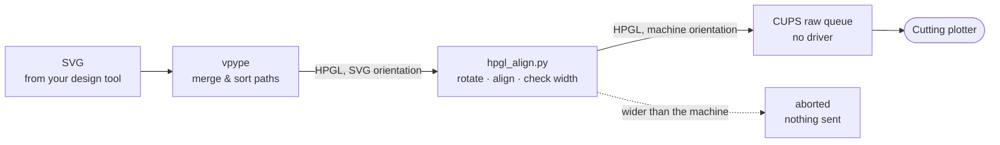

# Cutting Plotter on macOS — without SignMaster

Drive a USB vinyl cutting plotter from macOS using only free, open-source tools.
**No SignMaster, no paid software, no driver, no kext, no system extension.**

Most of these machines ship with [SignMaster](https://www.signmaster.software/),
which is Windows-only. The hardware itself speaks plain **HPGL** over a standard
USB printer interface — something macOS has supported natively for decades. This
repository provides the missing piece: a converter from SVG to correctly oriented
HPGL, plus a one-command setup.

Verified end-to-end on a **VEVOR SK-720L** (630 mm / 24.8" cutting width,
720 mm / 28.3" paper feed), driven from Affinity Designer artwork.

> **The single most important finding:** these plotters are **not** serial devices,
> even though the USB chip says otherwise. Every guide telling you to install a
> CH340 driver and pick a baud rate is wrong for this hardware.
> [See why](#why-the-usual-advice-fails).

---

## Contents

- [Why the usual advice fails](#why-the-usual-advice-fails)
- [How it works](#how-it-works)
- [Requirements](#requirements)
- [Setup](#setup)
- [Verify before you cut](#verify-before-you-cut)
- [Exporting from Affinity Designer / Illustrator / Inkscape](#exporting-from-your-design-tool)
- [Daily use](#daily-use)
- [Supported machines](#supported-machines)
- [Adding your machine](#adding-your-machine)
- [Troubleshooting](#troubleshooting)

---

## Why the usual advice fails

Search for "VEVOR plotter macOS" and you will be told to install a CH340 serial
driver, find `/dev/cu.wchusbserial*` and set a baud rate. On this hardware that
can never work. Here is what the machine actually reports:

```
idVendor 0x1A86 (wch.cn) · idProduct 0x5750
IOUSBHostInterface@0 · bInterfaceClass 7 · SubClass 1 · Protocol 2
```

**Interface class 7 is the USB printer class.** The device calls itself
"USB2.0 To Serial Port" and uses a WCH chip, which is why everyone assumes it is
a serial port — but it never enumerates as one. A CH340 driver binds to
vendor-class interfaces (class 255), not to class 7. There will never be a
`/dev/cu.*` entry, and baud rate is meaningless.

Check your own machine:

```bash
ioreg -rc IOUSBHostDevice -w0 | grep -i "USB Product Name"
ioreg -w0 -l -r -n "<name from above>" | grep bInterfaceClass
```

The good news: the USB printer class needs **no driver at all** on macOS.

**Second finding:** the SK-720L **ignores `PR;`** (relative HPGL coordinates). It
then reads those values as absolute positions, ends up with negative coordinates
and drives the carriage into the end stop — the display shows
`On-line right error >>>`. All output here is therefore absolute (`PA`).

## How it works



[vpype](https://github.com/abey79/vpype) converts and optimises the paths
(`linemerge` joins nearly touching paths, `linesort` shortens travel moves).
[`lib/hpgl_align.py`](lib/hpgl_align.py) then maps SVG orientation onto the
machine's axes, aligns the job to the origin and **refuses jobs wider than the
cutting width before anything is sent**.

Axis handling deliberately lives in a readable Python script rather than buried
in device-config subtleties. It prints the real dimensions of every job in
millimetres before you commit material to it.

## Requirements

- macOS (tested on macOS 26, Apple Silicon; nothing here is version-specific)
- [uv](https://docs.astral.sh/uv/) or pipx, to install vpype
- A design tool that exports SVG (Affinity Designer, Illustrator, Inkscape, Figma)

## Setup

**1. Install vpype**

vpype is a Python tool, so it needs an installer. If you have
[Homebrew](https://brew.sh), this is the whole story:

```bash
brew install uv
uv tool install vpype
```

`uv tool install` keeps vpype in its own isolated environment, so it cannot
collide with any other Python you have. Verify it worked:

```bash
vpype --version
```

<details>
<summary>Without Homebrew, or using pipx / pip instead</summary>

Install uv directly:

```bash
curl -LsSf https://astral.sh/uv/install.sh | sh
uv tool install vpype
```

Or use pipx, which isolates it the same way:

```bash
brew install pipx     # or: python3 -m pip install --user pipx
pipx install vpype
```

Plain pip works too, but install it into a virtualenv you manage yourself
rather than the system Python:

```bash
python3 -m venv ~/.venvs/vpype
~/.venvs/vpype/bin/pip install vpype
# then add ~/.venvs/vpype/bin to your PATH
```

Note that vpype is **not** available as a Homebrew formula — `brew install
vpype` will not work.
</details>

**2. Connect and power on the plotter**

**3. Create the print queue**

```bash
git clone https://github.com/CodeBrauer/cutting-plotter-macos.git
cd cutting-plotter-macos
./setup.sh
```

<details>
<summary>What <code>setup.sh</code> actually does</summary>

No magic and nothing hidden — four steps you could run by hand:

1. Asks CUPS which USB devices it can see (`lpinfo -v`)
2. Matches them against `USB_URI_MATCH` from the machine's `profile.env`
3. Creates a **raw** queue for that URI with `lpadmin`. Raw means CUPS passes
   the bytes through untouched instead of rendering them — exactly what a
   plotter needs, and why no driver or PPD is involved
4. Prints the queue status and which test to run next

The single command it boils down to:

```bash
lpadmin -p VEVOR_SK720L -E \
  -v 'usb://wch.cn/USB2.0%20To%20Serial%20Port?serial=WCH454545TS2' \
  -o printer-is-shared=false
```

It installs **no** driver, kext or system extension, and touches nothing
outside your CUPS printer list. Re-running it is safe: an existing queue is
updated rather than duplicated. To remove it again: `lpadmin -x VEVOR_SK720L`.

| Option | Meaning |
|---|---|
| *(none)* | Set up the only machine in `devices/` |
| `-d NAME` | Set up a specific machine |
| `-l` | Only list the USB devices CUPS sees, change nothing |
| `-h` | Show usage |

</details>

Your user must be in the `_lpadmin` group, which admin accounts are by default:

```bash
dseditgroup -o checkmember -m "$(id -un)" _lpadmin
```

If the plotter is not found, list what CUPS can see with `./setup.sh -l`.

## Verify before you cut

**Do this before trusting the machine with material.** Both files move the head
with the **blade up**, so you can run them with nothing loaded.

```bash
./plot tests/axis-y-crossfeed.hpgl   # carriage should travel 100 mm across and back
./plot tests/axis-x-feed.hpgl        # rollers should feed 100 mm and back
```

If the wrong mechanism moves, your machine's axes are swapped relative to this
profile — see [Adding your machine](#adding-your-machine).

Then check scale and mirroring on scrap vinyl:

```bash
./plot tests/calibration-100x50mm.svg   # measure: 100 x 50 mm, 10 mm inner square
./plot tests/mirror-test-f.svg          # an "F" -- must read correctly, not mirrored
```

The "F" matters. A rectangle with a corner mark **cannot** reveal mirroring,
because every corner is reachable by rotation alone. Mirrored text is only
obvious once you have wasted material on it.

Better still, look before you cut:

```bash
./plot -n -p tests/mirror-test-f.svg
```

This writes a preview SVG of the job as it will lie on the material. Judging
orientation on screen beats squinting at vinyl — a mirrored F and a rotated F
are genuinely easy to confuse.

## Exporting from your design tool

- Export as **plain SVG**
- Keep the document width within the **cutting width** (630 mm on the SK-720L —
  that is narrower than the 720 mm material feed)
- **Convert text to curves/outlines.** Only paths are processed, fonts are not
- Only **outlines** are cut; fills are ignored. Anything you want cut must be a
  path. In Affinity Designer: *Right click → Convert to Curves*

Whatever is wide in your design ends up across the roll; the height runs in the
feed direction. The `-r` option below turns it the other way round.

### Only one axis is limited

This is a roll-fed machine, so the **630 mm is the carriage travel, not a page
size**. In the feed direction you are limited by the roll, not the plotter —
two-metre banners are ordinary work. Only the crossfeed dimension is checked.

### If your design comes out far too large

Affinity Designer (and others) can export SVG without any physical size:

```xml
<svg width="100%" height="100%" viewBox="0 0 7087 4134">
```

There is no millimetre anywhere, so the units are read as pixels at 96 dpi, and
a 600 mm document arrives as 1874 mm. Exporting "at 300 dpi" does not change
this — SVG is a vector format with no inherent DPI, and that setting only
affects rasterised effects. The file comes out byte for byte identical.

Two ways around it, both reliable:

```bash
./plot -D 300 design.svg     # the document was authored at 300 dpi
./plot -w 480 design.svg     # or simply state the width you want, in mm
```

`-D` reproduces the original size; `-w` sets the size you want regardless of
what the file claims. For a cutter you usually have a specific measurement in
mind anyway, which makes `-w` the more direct answer.

To fix it at the source, export with a preset that writes physical units
(`width="600mm"`) rather than percentages.

## Daily use

```bash
./plot design.svg          # convert, align and cut
./plot -n design.svg       # dry run: show dimensions and HPGL, send nothing
./plot -m design.svg       # mirrored, for heat transfer / iron-on vinyl
./plot -r 270 design.svg   # rotate: 0, 90 (default), 180, 270
./plot ready.hpgl          # send existing HPGL untouched
```

### Options

| Option | Meaning |
|---|---|
| `-n` | Dry run. Convert, print the dimensions and the HPGL, send nothing |
| `-m` | Mirror the output — for heat transfer and iron-on vinyl, which is applied face down |
| `-p` | Also write `<name>-preview.svg` showing what will end up on the vinyl |
| `-s TOL` | Path simplification tolerance, default `0.05mm`. `-s 0` keeps every point |
| `-r 0\|90\|180\|270` | Rotation, in the SVG sense. Defaults to the machine profile's `DEFAULT_ROTATE` |
| `-w MM` | Scale proportionally to this width across the roll |
| `-D DPI` | Read the SVG's units at this DPI instead of 96 — see below |
| `-d NAME` | Which machine in `devices/` to use. Only needed once you have more than one |
| `-q NAME` | Use a different CUPS queue than the profile's |
| `-h` | Show usage |

Options combine, so `./plot -n -m -r 180 design.svg` previews a mirrored,
half-turned job without sending it.

### Check the orientation before cutting

```bash
./plot -n -p design.svg
```

`-p` writes an SVG showing the job as it will sit on the material, seen from
above. Open it and confirm the orientation there rather than on the machine —
a mirrored design and a rotated one look alike at a glance, and the difference
only becomes obvious once the vinyl is weeded.

If the result is upside down for your seating position, `-r 270` turns it
around; the design's own orientation is unaffected.

**Input handling:** anything ending in `.hpgl` is sent **unchanged** — no
rotation, no alignment, no width check. That keeps hand-written test files
meaningful. Everything else goes through vpype and `hpgl_align.py`.

`-r` rotates but never mirrors, so a design cannot come out backwards by
accident. Mirroring only ever happens when you ask for it with `-m`.

Every job reports its real size first:

```
-> Crossfeed (Y): 100.0 mm   Feed (X): 50.0 mm
-> HPGL: 109 bytes, 2x blade down
```

Anything wider than the cutting width **aborts before sending**. A crash into the
end stop should fail on your computer, not in your material.

`-n` costs nothing and catches scaling mistakes before they become waste.

## Supported machines

| Machine | Cutting width | Status | Profile |
|---|---|---|---|
| VEVOR SK-720L | 630 mm / 24.8" | Verified on hardware | [`devices/vevor-sk720l`](devices/vevor-sk720l) |
| VEVOR SK-870L | 870 mm | Shares the manual and firmware, untested | same profile |

The SK-720L is sold as *"VEVOR Vinyl Cutter Machine / Schneideplotter, 720mm,
SignMaster"*:
[product page (EN/EU)](https://eur.vevor.com/vinyl-cutter-c_11151/vevor-vinyl-cutter-machine-cutting-plotter-28in-bluetooth-signmaster-kit-bundle-p_010958201479)
· [Produktseite (DE)](https://www.vevor.de/schneideplotter-c_11151/vevor-schneideplotter-plottermaschine-630mm-folienschneider-signmaster-software-p_010958201479).
VEVOR lists its languages as *DM/PL, HP/GL*, which is what makes this approach work.

The manufacturer's manual is included at
[`devices/vevor-sk720l/manual/`](devices/vevor-sk720l/manual/) for convenience.

**Other HPGL cutters are likely to work.** Roland-compatible machines, and clones
sold under names like Redsail, Saga, Creation or PCUT, use the same command set.
If yours enumerates as a USB printer, you are most of the way there.

## Adding your machine

Pull requests welcome — see [CONTRIBUTING.md](CONTRIBUTING.md). In short: copy
[`devices/vevor-sk720l/`](devices/vevor-sk720l), adjust `profile.env` for your
cutting width and USB identifier, and run the verification tests above.

## Troubleshooting

**`plot` reports the job was sent, but the plotter does nothing**

CUPS has two independent states: a queue can keep **accepting** jobs while
being **stopped** for processing them. `lp` reports success either way and the
job just waits, which looks exactly like the machine ignoring you. CUPS stops a
queue by itself whenever a transfer fails.

`plot` checks for this now — before sending, and again afterwards — and refuses
to pretend a job went out when it did not. If you hit it anyway:

```bash
lpstat -p VEVOR_SK720L      # queue status
lpstat -o VEVOR_SK720L      # pending jobs
cancel -a VEVOR_SK720L && cupsenable VEVOR_SK720L
```

**Clear the queue before re-enabling.** Everything you sent while it was stopped
is still queued, and starts cutting the moment the queue comes back.

The usual cause is an oversized job stalling the USB transfer. Design tools
export curves far finer than a blade can follow: a 480 mm design can easily
carry 26 000 segments and reach 600 KB. `plot` simplifies to `0.05mm` by
default, below the machine's accuracy, which brings a job that size down to
roughly 18 KB with no visible difference. If you turned it off with `-s 0`,
turn it back on first.

**`On-line right error >>>` or similar end-stop error.** The job tried to leave
the cutting area. Reset the machine, set the origin again, **and clear the CUPS
queue** — otherwise the rest of the old job continues. If you sent hand-written
HPGL, check it uses `PA` (absolute), not `PR`.

**Plotter not listed by `./setup.sh -l`.** Confirm macOS sees the hardware at all:

```bash
ioreg -rc IOUSBHostDevice -w0 | grep -i "USB Product Name"
```

If it does not appear, it is a cable, hub or power issue — not a driver issue.
Try a direct port rather than a hub.

**Cut dimensions are wrong.** Re-run `tests/calibration-100x50mm.svg` and measure
both axes. If both are off by the same factor, adjust `UNITS_PER_MM` in the
machine's `profile.env`.

**Corners rounded or overcut.** Not a software problem — that is the blade offset,
set on the machine (typically 0.25 mm).

**Cut too deep or too shallow.** Blade pressure, speed and blade offset are all
set **on the machine**, not in software. Start low on new material and increase
until the vinyl is cut through but the backing paper is untouched.

## Licence

[MIT](LICENSE). The included manufacturer manual is VEVOR's own document,
redistributed for convenience. It carries the English section only.

---

Built with Claude and humans 🤖🤝🧑‍💻
